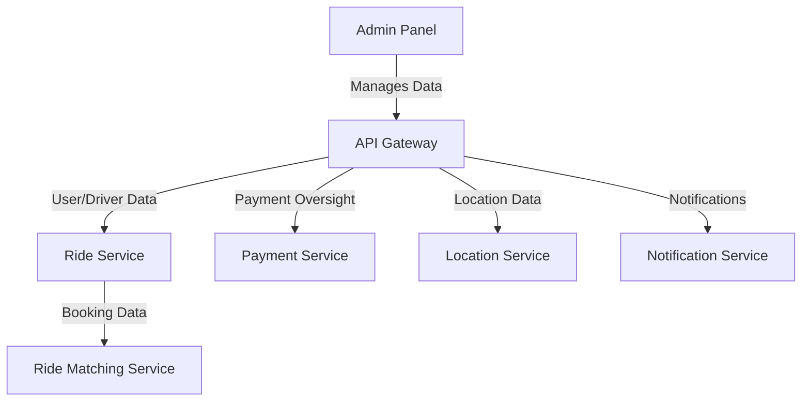

# Driver App

The Driver App is the mobile application for drivers in the ride-booking system, enabling them to manage ride requests, navigate to passengers, and track earnings. It is critical for driver-passenger coordination.

## Key Features
- **Driver Registration and Verification**: Submit documents for admin approval to ensure compliance.
- **Ride Request Management**: Accept or reject incoming ride requests with navigation to pickup locations.
- **Real-Time Location Updates**: Continuously update driver location for matching and tracking.
- **Earnings and Ride History**: View completed rides, earnings, and payment summaries.
- **Wait Time Charges**: Apply additional fees for waiting time after arriving at pickup.

## Architecture Diagram

## Interaction with Other Services
The Admin Panel interacts with backend services through the API Gateway to maintain system integrity:
- **API Gateway**: Routes administrative requests to various services for data access and updates.
- **Ride Service**: Provides data on bookings and user/driver interactions for management and reporting.
- **Payment Service**: Allows the Admin Panel to oversee transactions, refunds, and payroll for drivers.
- **Location Service**: Supplies location-based analytics for operational insights.
- **Notification Service**: Enables the Admin Panel to send bulk communications or updates to users and drivers.
- **Ride Matching Service**: Offers data on matching efficiency and driver assignments for administrative review.

