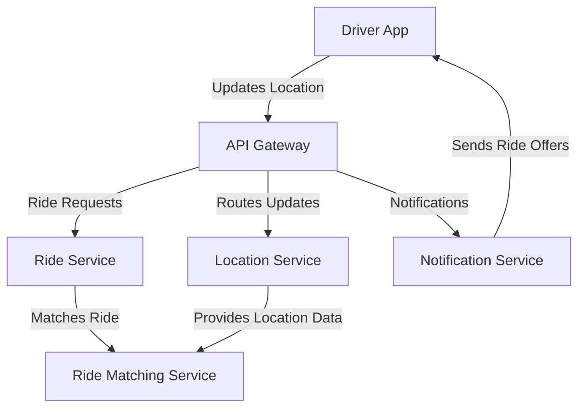

# Driver App

The Driver App is the mobile application for drivers in the ride-booking system, enabling them to manage ride requests, navigate to passengers, and track earnings.

## Key Features
- Driver Registration and Verification
- Ride Request Management
- Real-Time Location Updates
- Earnings and Ride History
- Wait Time Charges

## Recommended Tech Stack
- **Frontend**: React Native or Flutter for cross-platform iOS and Android development, ensuring ease of use for drivers [1][3].
- **Location Services**: Google Maps API or Mapbox for navigation; CoreLocation (iOS) and Fused Location Provider (Android) for geolocation [3][4].
- **Real-Time Updates**: WebSockets or Socket.IO for live ride requests and location sharing [3].
- **Authentication**: Firebase Authentication for secure driver access [7].

## System Design Structure
- **Client Layer**: Mobile app interface for driver interactions, built with React Native/Flutter.
- **API Integration**: Connects to API Gateway for ride requests and status updates.
- **Location Updates**: Continuously sends driver location to Location Service via API Gateway.
- **Navigation**: Uses Google Maps API for route guidance to passenger pickup.
- **Local Storage**: Caches ride history and earnings for offline viewing.

## Architecture Diagram

## Interaction with Other Services
The Driver App collaborates with backend services via the API Gateway:
- **API Gateway**: Routes driver location updates and ride interactions.
- **Location Service**: Receives real-time location data for tracking.
- **Ride Service**: Manages ride request acceptance or rejection.
- **Ride Matching Service**: Matches drivers with nearby passengers.
- **Notification Service**: Sends ride offers and status updates.

